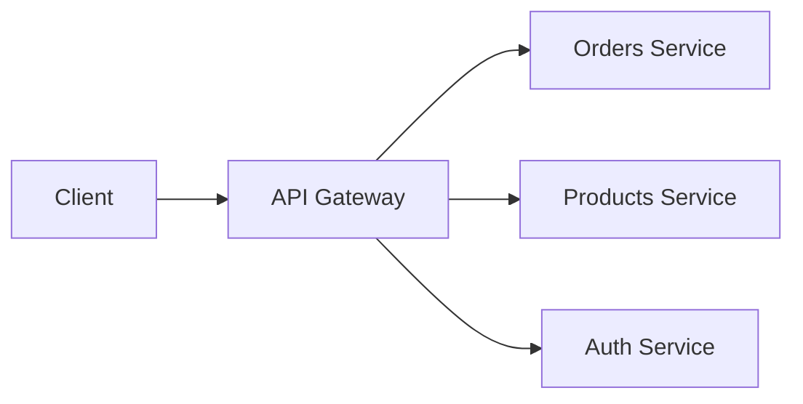

# FastAPI Gateway Example
This repository demonstrates a simple API Gateway implemented with FastAPI that routes requests to multiple downstream services (orders, products, users/auth). The gateway performs token validation, request forwarding (proxy), and injects a verified user identity header to upstream services when applicable.

Contents
- `gateway/` — gateway FastAPI application and configuration
- `orders/` — example Orders service (FastAPI)
- `products/` — example Products service (FastAPI)
- `users/` — example Users/Auth service (FastAPI + auth helpers)
- `env/` — optional virtualenv for local development (if present)

Goals
- Provide a small, runnable example of an API gateway using FastAPI
- Show routing/proxying patterns with `httpx` and path-prefix based routing
- Demonstrate configuration loading via `.env` and pydantic BaseSettings
- Demonstrate safe propagation of authenticated user identity to upstream services

Quick start (local)
1. Create and activate a Python virtualenv (or use the included `env` if present):

```bash
python -m venv env
source env/bin/activate
pip install -r requirements.txt
```

2. Start each service in separate terminals (or background):

```bash
python orders/main.py

python products/main.py

python users/main.py

python gateway/main.py
```

3. Test via curl:

```bash
# health
curl http://127.0.0.1:8000/health

# proxy to orders (gateway proxies under `/rajan/...` by default)
curl http://127.0.0.1:8000/rajan/order

# proxy to products
curl http://127.0.0.1:8000/rajan/product
```

Configuration
- Each service and the gateway support loading configuration from a `.env` file at their package root using pydantic BaseSettings (see `gateway/conf.py` and `users/conf.py`).
- Example `.env` (gateway/.env):

```
SECRET_KEY=your_dev_secret
ORDER_URL=http://127.0.0.1:8001
PRODUCT_URL=http://127.0.0.1:8002
AUTH_URL=http://127.0.0.1:8003
ACCESS_TOKEN_EXPIRE_MINUTES=30
```

Design & architecture

Overview

The gateway receives HTTP requests from clients and routes them to downstream services based on path prefixes (e.g. `/orders`, `/products`, `/auth`). It optionally performs token validation and injects a verified identity header so upstream services can trust the caller.

ASCII architecture diagram

```
											+----------------+
											|    Client(s)   |
											+--------+-------+
										            |
												    v
											+--------------------+
											|   API Gateway      |  (FastAPI)
											|  - validates token |
											|  - proxies request |
											|  - injects headers |
											+--+--------+--------+
												 |        |
				+----------------+        +------------------+.    +-------------------+
				|                                         |                            |
				v                                         v.                           v
	+-------------+                           +-------------+.                 +--------------+
	|   Orders    |                           |   Products  |                  |   User/Auth  |
	|  (FastAPI)  |                           |  (FastAPI)  |                  |   (FastAPI)  |
	+-------------+                           +-------------+                  +--------------+
```

Security & identity propagation
- Do NOT trust client-supplied identity headers. The gateway strips those headers.
- Prefer forwarding a verified Authorization token (if upstream can verify the same token), or mint a short-lived gateway-signed token, or inject signed identity headers (e.g. `X-User-Id` + `X-Gateway-Signature`).
- Use HTTPS between services and short TTLs for any gateway-minted tokens.

Implementation notes
- `gateway/network.py` contains the routing configuration and a `proxy_request` helper that forwards requests using `httpx.AsyncClient`. It preserves method, path, query params, headers (with filtering), and body.
- `gateway/conf.py` uses pydantic BaseSettings (with patterns compatible with pydantic v1/v2) to load configuration from `.env` and environment vars.
- `users/conf.py` demonstrates robust imports for pydantic BaseSettings across versions and uses typed fields for validation.

Extending the gateway
- Add rate-limiting, authentication caching, circuit-breakers, request/response transformations, header mapping, or logging/tracing (e.g., inject `X-Request-Id`).
- Consider using OpenTelemetry for distributed tracing.
- For large deployments, evaluate a service mesh or API management platform.

Diagrams and chat
- For higher-fidelity diagrams, paste the ASCII diagram into any diagram tool (draw.io, Lucidchart) and refine.
- Example mermaid diagram you can use in Markdown renderers that support it:



Conversation (design rationale)
- Q: Why validate tokens at the gateway?
	- A: To centralize auth, reduce duplication, and make routing decisions based on identity/role.

- Q: How to pass user identity to upstream services?
	- A: Use gateway-verified headers or gateway-minted short-lived tokens. Always sign or validate values to prevent spoofing.

Troubleshooting
- If pydantic raises BaseSettings import errors, install `pydantic-settings` for pydantic v2 compatibility:
	```bash
	pip install pydantic-settings
	```
- If you see bcrypt / passlib errors, ensure versions are compatible:
	```bash
	pip install --upgrade passlib bcrypt
	# or pin bcrypt to a compatible version
	pip install 'bcrypt==3.2.0'
	```

Next steps
- I can: patch the gateway to mint signed JWTs for upstreams, add an example verification helper to the `orders` app, or create a `requirements.txt` and a tiny `Makefile` to run services. Tell me which you prefer.

---

Author: example

